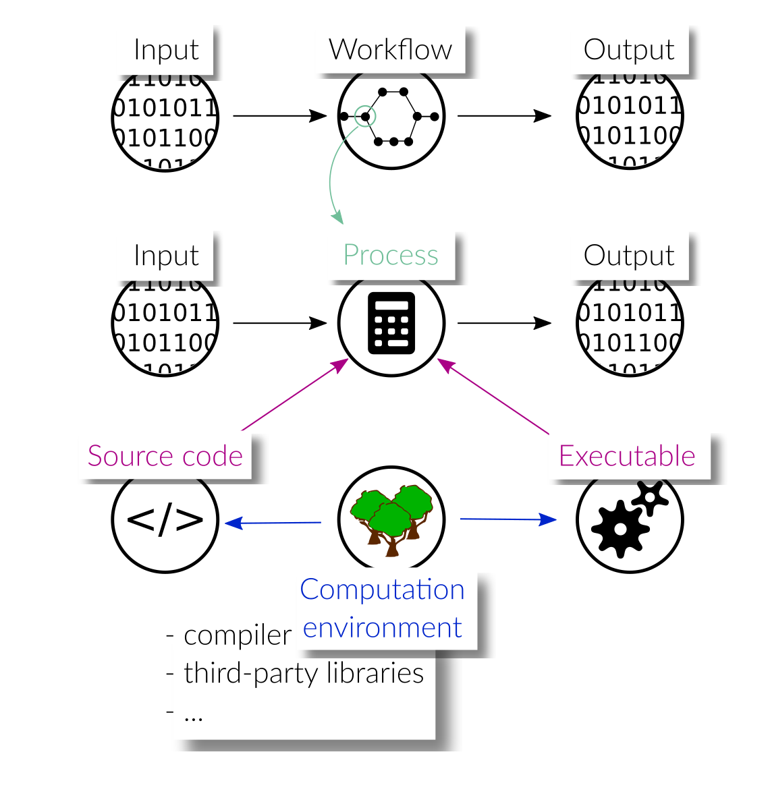

# Introduction - tools for scientific workflows

Software-driven scientific workflows are often characterized by a complex interplay
of various pieces of software executed in a particular order. The output of a
computational step may serve as input to a subsequent computation, which requires
them to be processed sequentially with a proper mapping of outputs to inputs.
Other computations are independent of each other and can be executed in parallel.
Thus, one of the main tasks of a workflow tool is a proper and efficient scheduling
of the individual processing steps.

Each processing step, just as the workflow itself, typically processes some input and
produces output data. Apart from changing the input data to operate on, processing
steps can usually be configured by a set of parameters to change their behavior.
Moreover, the behavior of a processing step is determined by its source code
and/or executable binaries/packages that are called within it. Beyond this, the
computation environment not only has a significant influence on its behavior, but
is also crucial in order for the processing step to work at all. The environment
includes the versions of the interpreters or compilers, as well as all third-party
libraries and packages that contribute to the computations carried out in a
processing step.

In order for research workflows to comply with the
[FAIR principles](https://www.go-fair.org/fair-principles/), they should be:

- published
- documented
- annotated with metadata
- reproducible
- reusable

Because of the dependency on their environment, reproducibility and reusability
is not trivial to achieve for scientific workflows. The results presented in a
scientific paper, for instance, are produced with a very specific environment,
and in order to guarantee reproducibility, this environment has to be reinstantiated
possibly many years later.

In this documentation we want to elaborate, together with the scientific community,
a vision on how scientific workflows should be created/packaged/published in order
to be as FAIR as possible. We want to evaluate if existing workflow tools provide
reusable solutions and identify the capabilities that are missing to reach our goal:
reproducible research workflows, by anyone, anywhere and anytime.

[Go to the documentation](https://nfdi4ingscientificworkflowrequirements.readthedocs.io/en/latest/).

## How to contribute
We greatly appreciate and encourage contributions by any users or developers of 
workflow tools. 
A list of preselected tools can be found in the [documentation](https://nfdi4ingscientificworkflowrequirements.readthedocs.io/en/latest/).
If you would like to add an implementation of the [simple use case](https://nfdi4ingscientificworkflowrequirements.readthedocs.io/en/latest/docs/simpleusecase.html) for a tool
(not limited to the given list), or if you suggest changes to one of the
existing implementations, please raise an issue and submit a pull request.
We also encourage to start a new [discussion](https://github.com/BAMresearch/NFDI4IngScientificWorkflowRequirements/discussions)
for general comments, questions and ideas you would like to share.

## Acknowledgements
We would like to thank the following people for their contribution to this repository:
* Who wants to be first?
