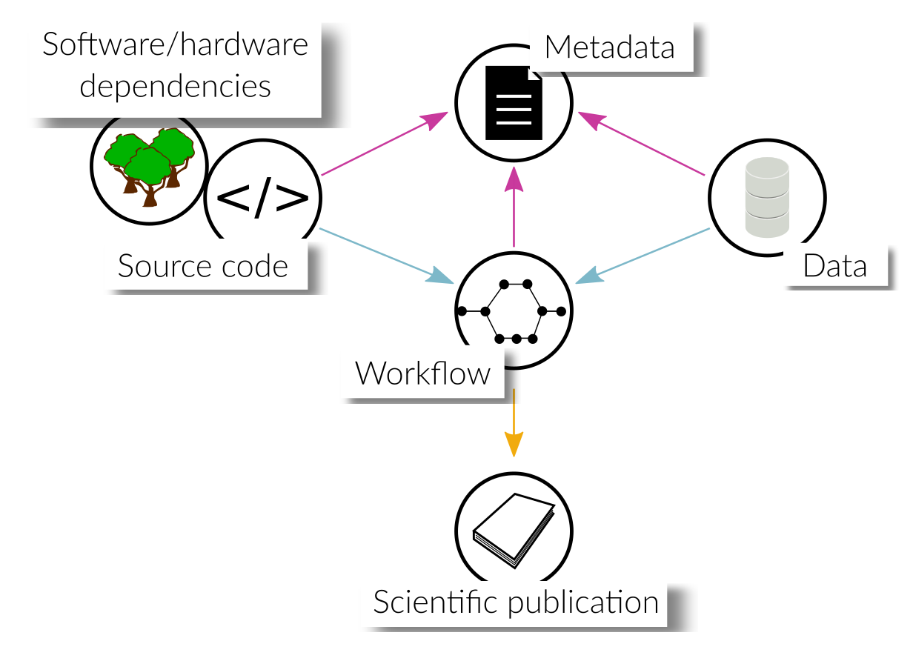

.. _fairness:

FAIRness of research workflows
==============================

As mentioned in the introduction, an overarching goal is to make research
software `FAIR <https://www.go-fair.org/fair-principles/>`_. In this section, we
therefore want to discuss possible aspects of FAIRness associated with the code
and data that are used in or produced by scientific inquiry. A scientific workflow
may consist of a variety of different pieces of software as well as input data,
which makes it nontrivial to publish it in a comprehensive, reusable and reproducible
way.

.. contents::

.. _transparency:

Increasing transparency
------------------------

By publishing the data and software used in scientific investigations, researchers
give their peers the opportunity to retrace the steps that were necessary to arrive
at the conclusions drawn in a publication. This significantly increases the
transparency of their research and besides this, it allows others to reuse the data
and software in proceeding investigations.

.. _reusable_data:

Reusable data
-------------

Integration of externally published research data in a research project may be
cumbersome if the data is not well-documented or self-explanatory. To mitigate
this, data should be published in standard formats that are widely used in the
community to guarantee their seamless integration into other projects. Moreover,
rich metadata should be provided, which explains the contents of the data in
detail and in a machine-readable format.

.. _reusable_software:

Reusable software
-----------------

Source code used to process or produce data should be published such
that other researchers can easily reconstruct how the data was generated or analyzed.
Besides a license which states terms and conditions of use, it is again important
to publish metadata alongside the code, which state the requirements of the software
on the compute environment, that is, compiler or interpreter versions, third-party libraries,
hardware requirements etc.

*Ideally, this code expresses only project-specific tasks, reusing established
packages for generic functionality, whenever possible, instead of reimplementing
it. This reduces the risk of bugs and makes it easier for other researchers
to understand the code, who possibly are familiar with the syntax of the used
packages. If generic, possibly reusable functionality has to be implemented, we encourage
researchers to publish these parts separately in the form of a code repository
and/or software package for others to use independently of the project-specific
code. This, of course, requires competence in sustainable software development
or the help of research software engineers.*

.. _reproducible workflows:

Reproducible research workflows
-------------------------------------

A scientific workflow may involve many different processes that are executed in
a particular order while exchanging data. With increasing number of processes,
retracing the workflow logic can become rather cumbersome. Using workflow tools
or languages to describe the logic and the flow of data provides the means to
communicate this in a more comprehensible way. Moreover, some tools provide
the possibility to visualize the workflow in a directed acyclic graph (DAG),
depicting inputs, outputs and metadata of the processes and how they are interconnected.
In addition to the graphical visualization of the provenance graph, the workflow tool
may also automatically track and record the full data provenance in a database.
Besides this, other researchers may easily extend or change the workflow by adding or exchanging processes.

In order for the workflow to be reproducible, metadata must be provided that state
the requirements on the compute environment and all of its dependencies, such that
users can prepare their system for the workflow execution. Ideally, workflow tools
automatically track the involved dependencies and/or provide the means to encapsulate
the environment (e.g. using container solutions) such that it can be distributed.
