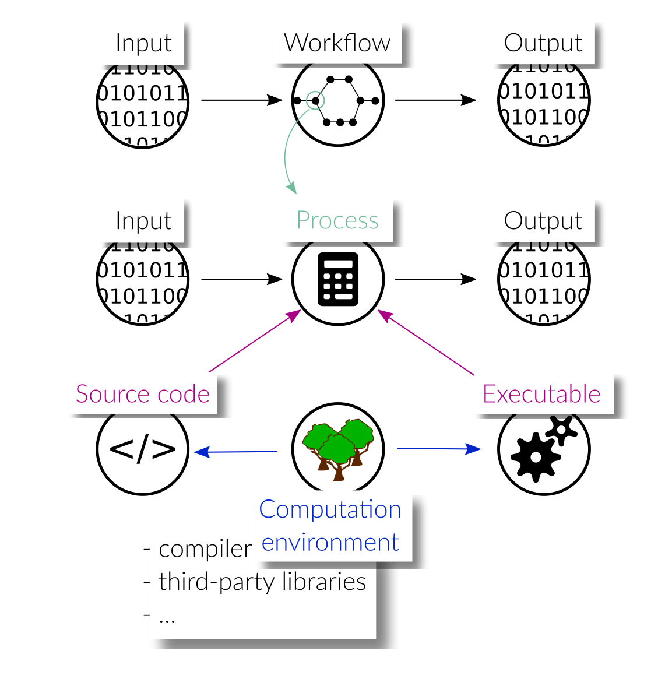

.. _introduction:

Introduction
============

Software-driven scientific workflows are often characterized by a complex interplay
of various pieces of software executed in a particular order. The output of a
computational step may serve as input to a subsequent computation, which requires
them to be processed sequentially with a proper mapping of outputs to inputs.
Other computations are independent of each other and can be executed in parallel.
Thus, one of the main tasks of workflow handling is the proper and efficient scheduling
of the individual processing steps.

Typically, each process in the workflow, just as the workflow itself, processes some
input to produce output data. Apart from changing the input data to operate on,
processes can usually be configured by a set of parameters to change their behavior.
Moreover, the behavior of a process is determined by its source code
and/or executable binaries/packages that are called within it. Beyond this, the
computation environment not only has a significant influence on its behavior, but
is also crucial in order for the process to work at all. The environment
includes interpreters and/or compilers, as well as third-party libraries and packages
that contribute to the computations carried out in the process. The exact version
numbers of all involved packages are crucial, as the workflow may fail to work with
newer or older packages, or, may produce different results.

In order for research workflows to comply with the
`FAIR principles <https://www.go-fair.org/fair-principles/>`_ (originally formulated
for research data), they should be:

- published
- documented
- annotated with metadata
- reproducible
- reusable

Because of the dependency on their environment, reproducibility and reusability
is not trivial to achieve for scientific workflows. The results presented in a
scientific paper, for instance, are produced with a very specific environment,
and in order to guarantee reproducibility, this environment has to be reinstantiated
possibly many years later.

In this documentation we want to elaborate, together with the scientific community,
a vision on how scientific workflows should be created/packaged/published in order
to be as FAIR as possible. We want to evaluate if existing workflow tools provide
reusable solutions and identify the capabilities that are missing to reach our goal:
reproducible research workflows, by anyone, anywhere and anytime.
