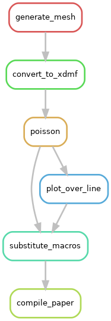

.. _simpleusecase:

Simple use case
===============
As a minimal working example representative of workflows in computational science, the 
poisson equation is solved using the finite element method for a set of predefined boundary conditions :math:`u_{\mathrm{D}}`
on a square domain :math:`\varOmega={(0, s)}^2, s\in\mathbb{R}^+`.

.. math::
    -\Delta u &= f\,,\quad&&\mathrm{in}\;\varOmega\,,\\
   u &= u_{\mathrm{D}}\,,\quad&&\mathrm{on}\;\partial\varOmega\,.

The domain size :math:`s` is defined as an input to the workflow, such that the workflow can
be run for different computational domains.
The final output of the workflow is a PDF document showing the solution :math:`u` over the
line :math:`L=\{(x, y)\in\varOmega\,\vert\,x=y\}` and the number of degrees of freedom used in the finite element model.
The (directed acyclic graph of the) workflow is shown below and consists of the following processes:

1. Partition of the computational domain using `Gmsh <http://gmsh.info/>`_, |DAG|

.. code-block:: console

   gmsh -2 -setnumber domain_size 1.0 source/square.geo -o ./square.msh

2. Conversion of the file format (into one readable by `FEniCS <https://fenicsproject.org/>`_) using `meshio <https://github.com/nschloe/meshio>`_,

.. code-block:: console

    meshio convert ./square.msh ./square.xdmf

3. Solution of the poisson equation using `FEniCS <https://fenicsproject.org/>`_,

.. code-block:: console

    python source/poisson.py --mesh ./square.xdmf --degree 2 --outputfile ./poisson.pvd

4. Postprocessing using `ParaView <https://www.paraview.org/>`_,

.. code-block:: console

    pvbatch source/postprocessing.py ./poisson.pvd ./plotoverline.csv

5. Preparation of macro definitions,

.. code-block:: console

    python source/prepare_paper_macros.py --macro-template-file source/macros.tex.template \
        --plot-data-path ./plotoverline.csv --domain-size 1.0 --num-dofs num_dofs \
        --output-macro-file ./macros.tex

6. Generation of a PDF using `LaTeX <https://www.latex-project.org/>`_, `Tectonic <https://tectonic-typesetting.github.io/en-US/>`_ respectively.

.. code-block:: console

    cp source/paper.tex ./paper.tex
    tectonic ./paper.tex 

It is important to note that the `source files <https://github.com/BAMresearch/NFDI4IngScientificWorkflowRequirements/blob/main/simple_use_case/source>`_ are
regarded as static inputs, i.e. changing them may break the workflow and thus
only the variable domain size should be exposed as an actual input parameter.
The number of degrees of freedom is written to stdout
by the FEniCS script `source/poisson.py`
and used here to showcase how one might deal with output of integer type (i.e. non-file output).
If the tool does not support this the number of degrees of freedom is written to a file.

Details on the specific versions used for each software package can be found in the `conda environment specification file <https://github.com/BAMresearch/NFDI4IngScientificWorkflowRequirements/blob/main/simple_use_case/source/envs/default_env.yaml>`_.
Exemplary implementations with various tools can be found `here <https://github.com/BAMresearch/NFDI4IngScientificWorkflowRequirements/tree/main/simple_use_case>`_.
