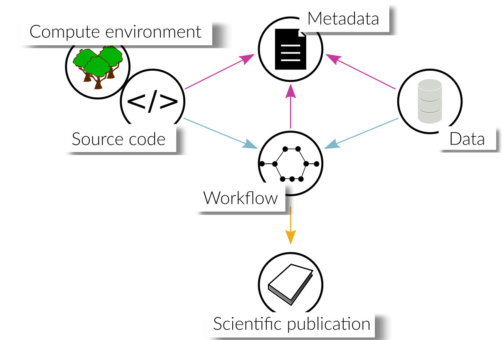

.. _vision_challenges:

Vision & Challenges
====================

As mentioned in the :ref:`introduction`, an overarching goal is to make research
software [FAIR](https://www.go-fair.org/fair-principles/). In this section, we
want to discuss possible levels of FAIRness associated with the code and data that
were used in or produced by scientific inquiry. An overview is given in the image
below, followed by a more detailed discussion.

.. contents::

.. _paper:

Level 0: scientific paper
-------------------------

Findings from research activities are usually communicated to the community by
means of publications in scientific journals. At the time of writing this article,
most scientific publications still stop at this level.

.. _transparency:

Level 1: transparent research
-----------------------------

Publishing the *data* used in or produced by scientific investigations allows peers
to reuse that data in their own research and to verify the conclusions that were
drawn from it. It is beneficial to publish the data in standard formats that are
widely used in the community to guarantee their seamless integration into other
projects. However, in order for the data to be usable, rich metadata has to be
provided which explains in detail what the data contains (see :ref:`metadata`).

Source code used to process or produce data should be published such
that other researchers can reconstruct how the data was generated or analyzed.
Ideally, this code expresses only project-specific tasks, reusing established
packages for generic functionality, whenever possible, instead of reimplementing
it. This reduces the risk of bugs and makes it easier for other researchers
to understand the code, which possibly are familiar with the syntax of the used
packages.

If generic, possibly reusable functionality *has* to be implemented, we encourage
researchers to publish these parts separately in the form of a code repository
and/or software package for others to use. This, of course, requires competence
in sustainable software development or the help of research software engineers.

.. _metadata:

Level 2: findable & reusable code & data
----------------------------------------

TODO

.. _workflow:

Level 3: published research workflows
-------------------------------------

TODO: this section would be on simply published workflows to see how data flows
and is processed. Possibly metadata available on how to install everything required
to run the workflow, but is not automatic.

.. _workflow_environment:

Level 4: reproducible research workflows
----------------------------------------

TODO: this section would be on workflows published with the environment (e.g. container)
to make it reproducible by anyone.

.. _workflow_web_interface:

Level 5: remotely executable research workflows
-----------------------------------------------

TODO: this section would be on hosting research workflows on some web platform to
ensure easy access for interested peers.
