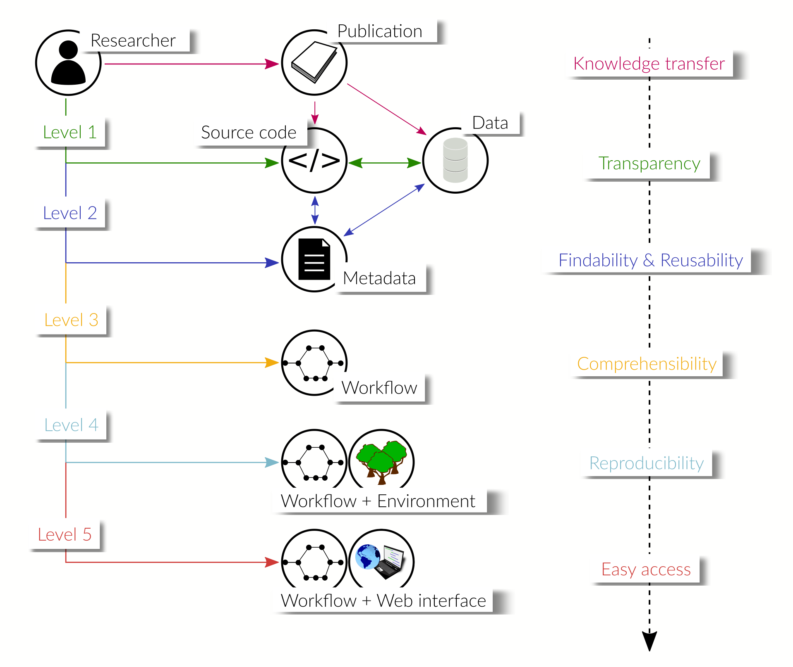

.. _vision_challenges:

FAIRness of research workflows
==============================

As mentioned in the :ref:`introduction`, an overarching goal is to make research
software `FAIR <https://www.go-fair.org/fair-principles/>`_. In this section, we
want to discuss possible aspects of FAIRness associated with the code and data that
are used in or produced by scientific inquiry. These aspects go beyond a mere publication
of the used raw data, but take into account the perspective of peers that want to
use it, possibly years after the publication.

.. contents::

.. _transparency:

Increasing transparency
------------------------

Publishing the *data* used in or produced by scientific investigations allows peers
to reuse it in their own research and to verify the conclusions that were
drawn from it. To this end, it is beneficial to publish the data in standard formats
that are widely used in the community to guarantee their seamless integration into
other projects. Moreover, in order for the data to be usable, rich metadata should be
provided, which explains the contents of the data in detail and in a machine-readable
format (see :ref:`metadata`).

*Source code* used to process or produce data should be published such
that other researchers can reconstruct how the data was generated or analyzed.
Ideally, this code expresses only project-specific tasks, reusing established
packages for generic functionality, whenever possible, instead of reimplementing
it. This reduces the risk of bugs and makes it easier for other researchers
to understand the code, which possibly are familiar with the syntax of the used
packages.

If generic, possibly reusable functionality *has* to be implemented, we encourage
researchers to publish these parts separately in the form of a code repository
and/or software package for others to use. This, of course, requires competence
in sustainable software development or the help of research software engineers.

.. _metadata:

Findable & reusable code & data
----------------------------------------

TODO

.. _workflow:

Documented research workflows
-------------------------------------

TODO: this section would be on simply published workflows to see how data flows
and is processed. Possibly metadata available on how to install everything required
to run the workflow, but is not automatic.

.. _workflow_environment:

Reproducible research workflows
----------------------------------------

TODO: this section would be on workflows published with the environment (e.g. container)
to make it reproducible by anyone.

.. _workflow_web_interface:

Remotely executable research workflows
-----------------------------------------------

TODO: this section would be on hosting research workflows on some web platform to
ensure easy access for interested peers.
