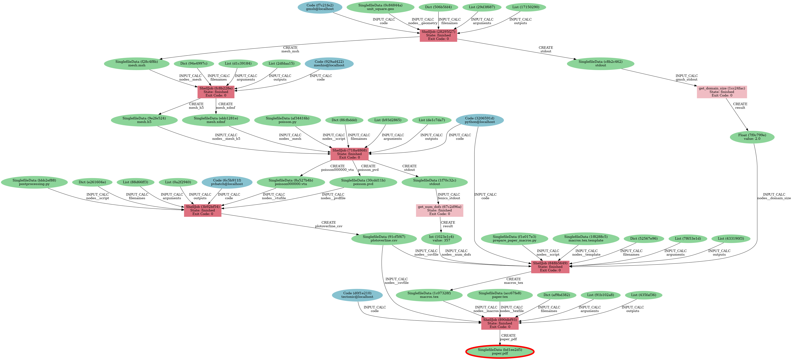

# AiiDA
This directory contains an implementation of the simple use case with [AiiDA](https://www.aiida.net/).

## Implementation
Since the implementation of workflows in AiiDA is quite different from the other file
based workflow managers (like e.g. snakemake or nextflow), we briefly comment on the different options
and design choices in AiiDA.

### Calculation functions
According to the [documentation](https://aiida.readthedocs.io/projects/aiida-core/en/latest/topics/calculations/concepts.html#calculation-functions): 
> The calcfunction in AiiDA is a function decorator that transforms a regular python function in a calculation process, which automatically stores the provenance of its output in the provenance graph when executed.

Typically `calcfunction`s are used for short running processes to be run on the local machine, like preprocessing and postprocessing steps.
One could think of a workaround, using `os.subprocess` inside a `calcfunction` to run the processes of the simple use case.
However, `calcfunction`s are not intended to be used to run external codes and the use of `os.subprocess` is discouraged since in this case the provenance cannot be properly captured by AiiDA.    

### Calculation jobs
> ... not all computations are well suited to be implemented as a python function, but rather are implemented as a separate code, external to AiiDA. To interface an external code with the engine of AiiDA, the CalcJob process class was introduced

The `CalcJob` is designed to run a `Code` on *any* computer through AiiDA. 
While this is very powerful, apart from installing the `Code` on the other computer it is necessary to setup the `code` with AiiDA and [write a plugin](https://aiida.readthedocs.io/projects/aiida-core/en/latest/howto/plugin_codes.html) which instructs AiiDA how to run the external `Code`.
For long running processes (computationally expensive tasks) this is worth the while, but for simple
shell commands the effort is too high.

### AiiDA shell plugin
The [AiiDA shell plugin](https://github.com/sphuber/aiida-shell) was developed to make it easier to run simple shell commands with AiiDA.
This way any command line tool (external code) installed on the *computer* can be run without the need to write a plugin.
Moreover, the `ShellJob` inherits from `CalcJob` and thus it is possible to run commands on remote computers.
Instructions on how to setup a remote computer can be found in this [how-to-guide](https://aiida.readthedocs.io/projects/aiida-core/en/latest/howto/run_codes.html#how-to-set-up-a-computer).

## Installation
Please follow the instructions in the [documentation](https://aiida.readthedocs.io/projects/aiida-core/en/latest/)
to make yourself familiar with the installation process.
It is recommended to use the system-wide installation method, where you first install prerequisite
services using a package manager (e. g. on Ubuntu)
```sh
sudo apt install \
    git python3-dev python3-pip \
    postgresql postgresql-server-dev-all postgresql-client rabbitmq-server
```
Next, we prepare a conda environment with all the software required to run the simple use case.
```sh
conda env create --name aiida_simplecase --file ../source/envs/default_env.yaml
conda activate aiida_simplecase
```
Make sure that the python version is greater than 3.8, since this is required by the `aiida-shell` plugin.
Next we install the `aiida-shell` plugin, which will automatically install AiiDA as a dependency.
Make sure that your conda environment is activated as above and run the following commands.
```sh
pip install aiida-shell==0.2.0
```
Finally, run
```sh
verdi quicksetup
```
to setup a profile and see if everything was installed correctly by running
```sh
verdi status
```

## Running the simple use case
If you are using `conda`, activate your environment.
```
conda activate aiida_simplecase
```
Make the workflow script executable (`chmod +x ./simple_use_case.py`) and run it with
```
./simple_use_case.py
```
By default all `ShellJob`s are run on the `localhost`.
Some useful commands to inspect the status of the processes run and their results stored in the database are listed below.
```
verdi process list -a           # lists all processes
verdi process show <PK>         # show info about process
verdi process report <PK>       # log messages if something went wrong
verdi node show <PK>            # show info about node
verdi node graph generate <PK>  # generate provenance graph for node
```
The provenance graph can be created in `.png` format with the command
```
verdi node graph generate --output-format png <PK>
```
and is shown below.

<center></center>
