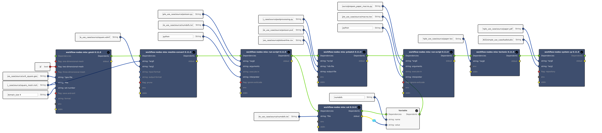

# KadiStudio
Implementation of the simple use case with KadiStudio. `KadiStudio` is a software component of the 
Kadi4Mat research data infrastructure, that is dedicated to model, visualise and execute scientific workflows using a GUI. 

## Installation
`KadiStudio` can be installed using the debian package provided [here](https://kadi4mat.iam-cms.kit.edu/records/6479).
To execute a workflow in KadiStudio, the two software components `process-manager` and `process-engine` are
required. They are available as debian packages and can be installed using the following commands:
```sh
wget https://gitlab.com/iam-cms/workflows/process-manager/-/jobs/artifacts/master/download?job=pack_deb -O process_manager.zip
wget https://gitlab.com/iam-cms/workflows/process-engine/-/jobs/1764662488/artifacts/download -O process_engine.zip
unzip process_*.zip
apt-get install --yes ./build/*.deb
```
The tools used within KadiStudio have to be installed separately using the python library
`workflow-nodes`, available with:

```sh
pip install workflow-nodes
```

## Creating workflows

Workflows can be created in KadiStudio using a GUI to which tools can be added using a point-and-click interface.
In the gif below this is exemplified by the simple use case. 


Each added tool represents a command that is run when the 
workflow is executed. Using the input ports on the left-hand side the corresponding tool can be parameterised. Connecting
the green dependency ports of the tools nodes defines the order of execution making the modelled workflow easier to 
grasp for the user.

The complete workflow saved in the simple_use_case.flow file is shown in the following image.


## Running the simple_use_case workflow

The execution of a workflow can either be started directly inside the GUI of KadiStudio or with the following CLI command:

```sh
process_manager start simple_use_case.flow
```

## Visualisation of the workflow

The workflow files can be visualised inside KadiStudio or on Kadi4Mat.
A visualisation of the simple_use_case.flow can be found [here](https://kadi4mat.iam-cms.kit.edu/records/9975/files/997c4ddd-0d36-4e8d-9014-0ce3f5dcb599).
